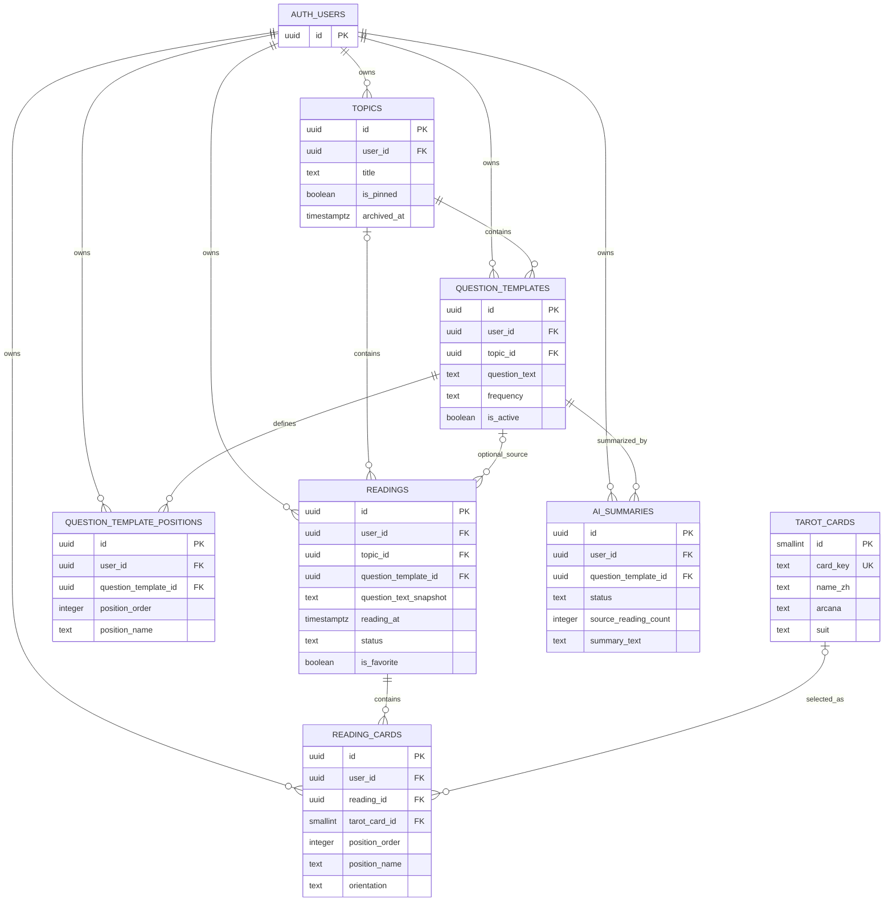

# Tarot Journal App MVP 数据库设计

> 文档状态：初始数据库设计
> 数据库：Supabase Postgres
> 对应迁移：`supabase/migrations/0001_initial_schema.sql`
> 执行状态：迁移文件已创建，但未执行

## 0. 核心设计结论

1. 用户身份由 Supabase Auth 的 `auth.users` 管理，MVP 不额外创建空壳 `profiles` 表。
2. 所有用户拥有的表都包含 `user_id`，并通过 RLS 限制为 `auth.uid() = user_id`。
3. `question_templates` 与 `readings` 独立。记录可以引用模板，但同时保存不可变的 `question_text_snapshot`。
4. `reading_cards` 每行代表牌阵中的一张牌，因此一条记录可以有任意数量的牌。
5. 固定问题的默认牌阵位置使用独立的 `question_template_positions` 表，不使用固定长度数组或 `position_1`、`position_2` 字段。
6. 草稿与正式记录共用 `readings`，由 `status` 区分。草稿牌条目可以尚未选牌，正式记录至少需要一张完整牌。
7. 百分比、频率和趋势不保存为可变的重复数据，而是从标准化历史记录计算。
8. AI 总结使用独立的 `ai_summaries` 表，只允许服务端写入，避免客户端伪造 AI 结果或接触服务端密钥。

## 1. 数据表清单

| 表                            | 类型                 | 作用                                                       |
| ----------------------------- | -------------------- | ---------------------------------------------------------- |
| `auth.users`                  | Supabase 托管        | 用户账户、认证身份和稳定的用户 UUID；不由本迁移创建        |
| `tarot_cards`                 | 全局只读参考表       | 标准 78 张塔罗牌的稳定编号、名称、大牌或小牌、花色和顺序   |
| `topics`                      | 用户数据             | 长期议题，例如论文、关系或事业                             |
| `question_templates`          | 用户数据             | 隶属于议题、可重复使用的固定问题模板                       |
| `question_template_positions` | 用户数据             | 固定问题的可选默认牌阵位置及顺序                           |
| `readings`                    | 用户数据             | 一次牌阵记录的主信息、问题快照、解释、反馈、草稿和收藏状态 |
| `reading_cards`               | 用户数据             | 一次牌阵中的任意数量牌，以及每张牌的位置、顺序和正逆位     |
| `ai_summaries`                | 用户可读、服务端写入 | 后期保存固定问题范围内的 AI 趋势总结及其数据范围           |

`reading_feedback` 没有单独建表，因为 MVP 每条记录只有一段后续现实反馈。未来若需要多次、带日期的反馈事件，再拆分为一对多表。

## 2. 字段设计

### 2.1 `auth.users`

该表由 Supabase Auth 管理。本应用只引用其主键，不复制邮箱、密码哈希或认证元数据到 `public` schema。

| 字段 | 类型   | 可为空 | 默认值             | 说明                                        |
| ---- | ------ | ------ | ------------------ | ------------------------------------------- |
| `id` | `uuid` | 否     | Supabase Auth 生成 | 用户稳定主键，所有用户表的 `user_id` 指向它 |

如果后期确实需要昵称、首选语言等应用资料，再添加 `profiles` 表，并使用 `id = auth.users.id` 的一对一关系。

### 2.2 `tarot_cards`

| 字段         | 类型       | 可为空 | 默认值 | 说明                                |
| ------------ | ---------- | ------ | ------ | ----------------------------------- |
| `id`         | `smallint` | 否     | 无     | 主键，范围 0–77                     |
| `card_key`   | `text`     | 否     | 无     | 稳定英文机器键，例如 `swords_eight` |
| `name_zh`    | `text`     | 否     | 无     | 中文显示名                          |
| `name_en`    | `text`     | 否     | 无     | 英文显示名                          |
| `arcana`     | `text`     | 否     | 无     | `major` 或 `minor`                  |
| `suit`       | `text`     | 是     | `NULL` | 小牌花色；大牌必须为空              |
| `rank_code`  | `text`     | 否     | 无     | `ace`、`two`、`page`，或大牌编号    |
| `rank_order` | `smallint` | 否     | 无     | 花色内排序或大牌编号                |
| `sort_order` | `smallint` | 否     | 无     | 完整牌表显示顺序，唯一              |

这是共享、不可由客户端修改的参考表，因此没有 `user_id`。它是“所有业务表考虑 `user_id`”原则的唯一例外，因为其中没有私人数据。

### 2.3 `topics`

| 字段          | 类型          | 可为空 | 默认值              | 说明                                |
| ------------- | ------------- | ------ | ------------------- | ----------------------------------- |
| `id`          | `uuid`        | 否     | `gen_random_uuid()` | 主键                                |
| `user_id`     | `uuid`        | 否     | `auth.uid()`        | 所有者，外键到 `auth.users.id`      |
| `title`       | `text`        | 否     | 无                  | 议题名称，去除首尾空格后 1–120 字符 |
| `description` | `text`        | 是     | `NULL`              | 可选说明，最多 5000 字符            |
| `is_pinned`   | `boolean`     | 否     | `false`             | 是否置顶                            |
| `archived_at` | `timestamptz` | 是     | `NULL`              | 为空表示进行中，有值表示已归档      |
| `created_at`  | `timestamptz` | 否     | `now()`             | 创建时间                            |
| `updated_at`  | `timestamptz` | 否     | `now()`             | 最近更新时间，由触发器维护          |

不额外保存 `status = active/archived`，因为 `archived_at` 已同时表达状态和归档时间。

### 2.4 `question_templates`

| 字段            | 类型          | 可为空 | 默认值              | 说明                             |
| --------------- | ------------- | ------ | ------------------- | -------------------------------- |
| `id`            | `uuid`        | 否     | `gen_random_uuid()` | 主键                             |
| `user_id`       | `uuid`        | 否     | `auth.uid()`        | 所有者                           |
| `topic_id`      | `uuid`        | 否     | 无                  | 所属长期议题                     |
| `question_text` | `text`        | 否     | 无                  | 当前模板文本，1–1000 字符        |
| `frequency`     | `text`        | 否     | `as_needed`         | `as_needed`、`daily` 或 `weekly` |
| `is_active`     | `boolean`     | 否     | `true`              | 是否继续出现在快速记录选择器中   |
| `is_pinned`     | `boolean`     | 否     | `false`             | 是否在议题内置顶                 |
| `created_at`    | `timestamptz` | 否     | `now()`             | 创建时间                         |
| `updated_at`    | `timestamptz` | 否     | `now()`             | 最近更新时间                     |

模板文本可以修改，但修改不会回写到历史记录，因为 `readings` 保存独立快照。

### 2.5 `question_template_positions`

| 字段                   | 类型          | 可为空 | 默认值              | 说明                                                |
| ---------------------- | ------------- | ------ | ------------------- | --------------------------------------------------- |
| `id`                   | `uuid`        | 否     | `gen_random_uuid()` | 主键                                                |
| `user_id`              | `uuid`        | 否     | `auth.uid()`        | 所有者                                              |
| `question_template_id` | `uuid`        | 否     | 无                  | 所属固定问题模板                                    |
| `position_order`       | `integer`     | 否     | 无                  | 从 1 开始的显示顺序，同一模板内唯一，事务结束时检查 |
| `position_name`        | `text`        | 否     | 无                  | 位置名称，1–120 字符                                |
| `created_at`           | `timestamptz` | 否     | `now()`             | 创建时间                                            |
| `updated_at`           | `timestamptz` | 否     | `now()`             | 最近更新时间                                        |

模板可以没有任何默认位置，也可以有任意数量的位置。新建记录时，客户端将这些位置复制到 `reading_cards.position_name`，之后二者互不影响。

### 2.6 `readings`

| 字段                     | 类型          | 可为空 | 默认值              | 说明                                           |
| ------------------------ | ------------- | ------ | ------------------- | ---------------------------------------------- |
| `id`                     | `uuid`        | 否     | `gen_random_uuid()` | 主键                                           |
| `user_id`                | `uuid`        | 否     | `auth.uid()`        | 所有者                                         |
| `topic_id`               | `uuid`        | 是     | `NULL`              | 正式记录必须归属议题；尚未选择议题的草稿可为空 |
| `question_template_id`   | `uuid`        | 是     | `NULL`              | 固定问题模板；为空表示临时问题                 |
| `question_text_snapshot` | `text`        | 是     | `NULL`              | 正式记录发生时的问题文本；不完整草稿可为空     |
| `reading_at`             | `timestamptz` | 否     | `now()`             | 用户选择的牌阵日期和时间                       |
| `reading_timezone`       | `text`        | 否     | `UTC`               | 记录时的 IANA 时区，例如 `Africa/Nairobi`      |
| `interpretation`         | `text`        | 是     | `NULL`              | 用户个人解释，最多 20000 字符                  |
| `reality_feedback`       | `text`        | 是     | `NULL`              | 后续现实反馈，最多 20000 字符                  |
| `status`                 | `text`        | 否     | `draft`             | `draft` 或 `completed`                         |
| `is_favorite`            | `boolean`     | 否     | `false`             | 是否收藏该记录                                 |
| `created_at`             | `timestamptz` | 否     | `now()`             | 创建时间                                       |
| `updated_at`             | `timestamptz` | 否     | `now()`             | 最近更新时间                                   |

#### 问题快照规则

- 固定问题记录：插入时由数据库从模板复制 `question_text`。
- 模板之后被修改：历史 `question_text_snapshot` 保持不变。
- 用户编辑固定问题记录：不能直接改写快照；若切换到另一个模板，数据库复制新模板当前文本。
- 临时问题正式记录：`question_template_id` 为空，用户必须提供非空快照文本，并可在编辑时修正。
- 尚未选择问题的草稿：模板和快照都可以为空；转为正式记录前必须补齐。

#### 草稿规则

- 草稿允许尚未选择议题、问题或完整牌。
- 正式记录必须至少有一条 `reading_cards`，并且每条都已选择 `tarot_card_id`。
- 数据库使用延迟约束触发器检查正式记录，避免空牌阵进入时间线和统计。
- 推荐保存顺序是：创建或更新为 `draft` → 写入牌条目 → 将状态更新为 `completed`。

### 2.7 `reading_cards`

| 字段             | 类型          | 可为空 | 默认值              | 说明                                            |
| ---------------- | ------------- | ------ | ------------------- | ----------------------------------------------- |
| `id`             | `uuid`        | 否     | `gen_random_uuid()` | 主键                                            |
| `user_id`        | `uuid`        | 否     | `auth.uid()`        | 所有者                                          |
| `reading_id`     | `uuid`        | 否     | 无                  | 所属单次记录                                    |
| `tarot_card_id`  | `smallint`    | 是     | `NULL`              | 选择的标准牌；只允许草稿为空                    |
| `position_order` | `integer`     | 否     | 无                  | 从 1 开始的牌序，同一记录内唯一，事务结束时检查 |
| `position_name`  | `text`        | 是     | `NULL`              | 本次记录中的牌阵位置快照，最多 120 字符         |
| `orientation`    | `text`        | 否     | `upright`           | `upright` 或 `reversed`                         |
| `created_at`     | `timestamptz` | 否     | `now()`             | 创建时间                                        |
| `updated_at`     | `timestamptz` | 否     | `now()`             | 最近更新时间                                    |

没有 `card_1`、`card_2`、`card_3`。一条记录有十张牌时，就是十行 `reading_cards`；牌数没有数据库上限。

顺序唯一约束是可延迟约束，因此一次事务可以批量交换多个顺序值，并在事务结束时检查最终结果。实现拖动排序时应使用事务或受控数据库函数，不要把半完成的排序状态暴露为正式记录。

### 2.8 `ai_summaries`

| 字段                            | 类型          | 可为空 | 默认值              | 说明                                                |
| ------------------------------- | ------------- | ------ | ------------------- | --------------------------------------------------- |
| `id`                            | `uuid`        | 否     | `gen_random_uuid()` | 主键                                                |
| `user_id`                       | `uuid`        | 否     | 无                  | 所有者，由服务端显式写入                            |
| `question_template_id`          | `uuid`        | 否     | 无                  | 总结所属固定问题                                    |
| `status`                        | `text`        | 否     | `pending`           | `pending`、`completed` 或 `failed`                  |
| `period_start`                  | `timestamptz` | 是     | `NULL`              | 总结数据范围起点                                    |
| `period_end`                    | `timestamptz` | 是     | `NULL`              | 总结数据范围终点                                    |
| `source_reading_count`          | `integer`     | 否     | `0`                 | 输入中使用的正式记录数量                            |
| `source_max_reading_updated_at` | `timestamptz` | 是     | `NULL`              | 输入记录中最新的 `updated_at`，用于判断总结是否过期 |
| `summary_text`                  | `text`        | 是     | `NULL`              | 总结正文，最多 50000 字符                           |
| `model_name`                    | `text`        | 是     | `NULL`              | 使用的模型名称，最多 200 字符                       |
| `prompt_version`                | `text`        | 是     | `NULL`              | 提示词或总结逻辑版本，最多 100 字符                 |
| `created_at`                    | `timestamptz` | 否     | `now()`             | 创建时间                                            |
| `updated_at`                    | `timestamptz` | 否     | `now()`             | 最近更新时间                                        |

MVP 可以暂时不调用 AI，但先建这张独立表可以避免未来把机器生成文本混入用户自己的 `interpretation`。客户端只有读取和删除权限，插入与更新必须由安全的服务端完成。

## 3. 主键和外键

### 3.1 主键

- 用户业务表使用 UUID 主键，默认 `gen_random_uuid()`。
- `tarot_cards` 使用 0–77 的 `smallint`，因为它是固定且极小的全局目录。
- `auth.users.id` 是用户身份的 UUID 主键。

### 3.2 外键

| 子表字段                                                     | 父表字段                                    | 删除动作         | 目的                                                         |
| ------------------------------------------------------------ | ------------------------------------------- | ---------------- | ------------------------------------------------------------ |
| 所有用户表的 `user_id`                                       | `auth.users.id`                             | `CASCADE`        | 删除账户时清除该用户全部数据                                 |
| `question_templates(topic_id, user_id)`                      | `topics(id, user_id)`                       | `CASCADE`        | 模板必须属于同一用户的议题                                   |
| `question_template_positions(question_template_id, user_id)` | `question_templates(id, user_id)`           | `CASCADE`        | 默认位置必须属于同一用户的模板                               |
| `readings(topic_id, user_id)`                                | `topics(id, user_id)`                       | `CASCADE`        | 记录必须属于同一用户的议题                                   |
| `readings(question_template_id, topic_id, user_id)`          | `question_templates(id, topic_id, user_id)` | 延迟 `NO ACTION` | 固定问题引用必须同时匹配用户和议题；已有历史时不能硬删除模板 |
| `reading_cards(reading_id, user_id)`                         | `readings(id, user_id)`                     | `CASCADE`        | 牌条目必须属于同一用户的记录                                 |
| `reading_cards.tarot_card_id`                                | `tarot_cards.id`                            | `RESTRICT`       | 已使用的标准牌不能被删除                                     |
| `ai_summaries(question_template_id, user_id)`                | `question_templates(id, user_id)`           | `CASCADE`        | AI 总结必须属于同一用户的固定问题                            |

包含 `user_id` 的复合外键是第二道隔离保护。即使客户端猜到其他用户的 UUID，也不能把自己的记录挂到别人的议题或模板上。

## 4. 关系设计

| 关系                | 类型               | 说明                                                         |
| ------------------- | ------------------ | ------------------------------------------------------------ |
| 用户 → 议题         | 一对多             | 一个用户拥有多个长期议题                                     |
| 议题 → 固定问题     | 一对多             | 一个议题拥有多个问题模板                                     |
| 固定问题 → 默认位置 | 一对多             | 模板可有零个或任意数量默认位置                               |
| 议题 → 记录         | 一对多，草稿端可选 | 所有正式记录都属于议题；尚未选择议题的不完整草稿可以暂时为空 |
| 固定问题 → 记录     | 一对多，可选       | 固定问题可有多次记录；临时问题记录不引用模板                 |
| 记录 → 牌条目       | 一对多             | 一次牌阵包含任意数量的牌                                     |
| 标准牌 → 牌条目     | 一对多，可选       | 正式牌条目引用一张标准牌；未完成草稿可暂时为空               |
| 固定问题 → AI 总结  | 一对多             | 同一问题可保留不同时间范围或版本的总结                       |

从业务视角看，`reading_cards` 也是 `readings` 与 `tarot_cards` 的带属性关联表，因此二者形成多对多关系：同一标准牌可出现在许多记录中，一条记录也包含多张标准牌。

## 5. 必要索引

主键和 `UNIQUE` 约束会自动产生索引。迁移另外创建以下查询索引：

| 索引                                       | 主要服务的查询                               |
| ------------------------------------------ | -------------------------------------------- |
| `topics_active_list_idx`                   | 当前用户的进行中议题，置顶优先、最近更新优先 |
| `question_templates_active_list_idx`       | 某议题启用中的固定问题，置顶优先             |
| `question_template_positions_template_idx` | 按顺序加载模板默认位置                       |
| `readings_topic_timeline_idx`              | 一个议题的正式记录时间线                     |
| `readings_question_timeline_idx`           | 同一固定问题的正式记录时间线和趋势分析       |
| `readings_drafts_idx`                      | 首页按最近更新时间恢复草稿                   |
| `readings_favorites_idx`                   | 当前用户收藏的正式记录                       |
| `reading_cards_analysis_idx`               | 用户维度的重复牌、牌频率和记录关联查询       |
| `ai_summaries_question_idx`                | 获取某固定问题最新的 AI 总结                 |

这些索引把 `user_id` 放在前面，与 RLS 的用户过滤和主要查询模式一致。部分索引只包含进行中、正式、草稿或收藏等真正需要快速访问的行，减少不必要的索引体积。

## 6. 删除策略

| 对象       | 客户端策略                                              | 数据库硬删除行为                                       |
| ---------- | ------------------------------------------------------- | ------------------------------------------------------ |
| 用户账户   | 通过受控账户删除流程                                    | `auth.users` 删除后级联清除全部用户数据                |
| 长期议题   | 只归档，客户端没有 `DELETE` 权限                        | 管理端硬删除会级联模板、记录、牌条目和总结             |
| 固定问题   | 使用 `is_active = false` 停用，客户端没有 `DELETE` 权限 | 有历史记录时延迟外键阻止硬删除；无历史时可由管理端删除 |
| 默认位置   | 允许用户删除和重新排序                                  | 删除不影响已经生成的历史牌位置快照                     |
| 记录       | 用户确认后可硬删除                                      | 级联删除其全部 `reading_cards`                         |
| 单张牌条目 | 编辑记录时可删除                                        | 正式记录不能因此变成空牌阵或包含未选牌条目             |
| 标准牌     | 客户端不可修改或删除                                    | 被历史记录引用时 `RESTRICT`                            |
| AI 总结    | 用户可删除自己的总结                                    | 不影响原始记录和统计                                   |

MVP 不使用通用 `deleted_at` 软删除。软删除会让每个查询、唯一约束和统计都更复杂；议题和模板已经分别通过归档与停用满足主要恢复需求。

## 7. Row Level Security 设计

Supabase 的 `public` 表通过 Data API 暴露时必须显式启用 RLS。策略使用 `(select auth.uid()) = user_id`，并为插入使用 `WITH CHECK`、为更新同时使用 `USING` 与 `WITH CHECK`。这与 [Supabase RLS 官方文档](https://supabase.com/docs/guides/database/postgres/row-level-security) 的推荐形式一致。

### 7.1 权限矩阵

| 表                            | `SELECT`       | `INSERT`   | `UPDATE`   | `DELETE`     |
| ----------------------------- | -------------- | ---------- | ---------- | ------------ |
| `tarot_cards`                 | 所有已登录用户 | 无         | 无         | 无           |
| `topics`                      | 仅自己的行     | 仅自己的行 | 仅自己的行 | 无，使用归档 |
| `question_templates`          | 仅自己的行     | 仅自己的行 | 仅自己的行 | 无，使用停用 |
| `question_template_positions` | 仅自己的行     | 仅自己的行 | 仅自己的行 | 仅自己的行   |
| `readings`                    | 仅自己的行     | 仅自己的行 | 仅自己的行 | 仅自己的行   |
| `reading_cards`               | 仅自己的行     | 仅自己的行 | 仅自己的行 | 仅自己的行   |
| `ai_summaries`                | 仅自己的行     | 客户端无   | 客户端无   | 仅自己的行   |

### 7.2 Data API 授权

RLS 和表级 `GRANT` 是两层保护：角色先要有操作表的权限，之后 RLS 再决定能操作哪些行。迁移先撤销 `anon` 和 `authenticated` 的默认权限，再只向 `authenticated` 授予矩阵中需要的操作。Supabase 也建议同时使用最小表权限和 RLS，详见 [Securing your API](https://supabase.com/docs/guides/api/securing-your-api)。

### 7.3 AI 服务端写入

- 移动端不能直接插入或更新 `ai_summaries`。
- 后期由 Edge Function 或其他受信任服务端验证用户身份、读取该用户的原始数据并写入总结。
- `service_role` 可以绕过 RLS，因此它只能存在于服务端，并且每个服务端查询都必须显式按 `user_id` 过滤。
- 服务端密钥绝不能进入 Expo 客户端或公开环境变量。

## 8. 用户数据隔离方式

隔离不是只依赖一层：

1. **身份层：** Supabase Auth 为每个请求提供用户 UUID。
2. **表字段层：** 每张用户数据表都保存不可为空的 `user_id`。
3. **RLS 层：** 已登录用户只能看到和修改 `auth.uid()` 与 `user_id` 相同的行。
4. **权限层：** `anon` 没有业务表权限，`authenticated` 只获得必要操作。
5. **关系层：** 父子关系使用带 `user_id` 的复合外键，阻止跨用户引用。
6. **服务端层：** 使用 `service_role` 的后期任务必须自己添加 `user_id` 条件，因为该角色不受普通 RLS 限制。

PostgreSQL 的外键完整性检查会独立于行安全执行，因此不能只靠 RLS 推断父对象所有权；复合外键提供了明确的数据完整性约束。相关行为见 [PostgreSQL Row Security Policies](https://www.postgresql.org/docs/17/ddl-rowsecurity.html)。

## 9. 对分析查询友好的设计

### 9.1 为什么拆分牌条目

每张牌是一行后，可以直接使用 `COUNT`、`GROUP BY` 和条件聚合计算：

- 某固定问题最常重复的牌。
- 大阿尔卡那与四种花色分布。
- 正位与逆位比例。
- 某个牌阵位置最常出现的牌。
- 某张牌在不同日期和问题中的出现记录。

如果使用 `card_1`、`card_2`、`card_3`，每增加一种牌阵长度都会修改表结构，分析还需要合并多个列，因此本设计明确禁止这种做法。

### 9.2 代表性频率查询

```sql
select
  tc.card_key,
  tc.name_zh,
  count(*) as appearance_count
from public.readings as r
join public.reading_cards as rc
  on rc.reading_id = r.id
  and rc.user_id = r.user_id
join public.tarot_cards as tc
  on tc.id = rc.tarot_card_id
where r.question_template_id = $1
  and r.status = 'completed'
group by tc.id, tc.card_key, tc.name_zh
order by appearance_count desc, tc.sort_order;
```

在移动端用户会话中，RLS 会自动限制为当前用户。服务端若使用 `service_role`，必须额外加入 `r.user_id = $2`。

### 9.3 不提前保存派生指标

MVP 不创建 `upright_percentage`、`most_common_card` 等字段，因为原始记录改变后这些字段很容易过期。先直接查询标准化数据；只有真实数据量和性能测试证明需要时，才增加安全视图、物化视图或缓存表。

复合索引与部分索引分别依据常见过滤列和实际活跃子集设计，原则可参考 [PostgreSQL Multicolumn Indexes](https://www.postgresql.org/docs/current/indexes-multicolumn.html) 和 [Partial Indexes](https://www.postgresql.org/docs/current/indexes-partial.html)。

### 9.4 AI 总结的新鲜度

`source_reading_count` 和 `source_max_reading_updated_at` 记录总结生成时看到的数据状态。后续只要当前正式记录数量或最大更新时间发生变化，就可以把旧总结标记为可能过期，而无需把 AI 文本当成真实数据来源。

## 10. TypeScript 类型示例

实际开发时应通过 Supabase CLI 从数据库生成 `database.types.ts`，避免手工类型与 schema 漂移。以下仅展示领域类型如何表达草稿、固定问题和临时问题，不是前端实现。

```ts
export type UUID = string;
export type ISODateTime = string;

export type ReadingStatus = 'draft' | 'completed';
export type CardOrientation = 'upright' | 'reversed';
export type QuestionFrequency = 'as_needed' | 'daily' | 'weekly';

export interface ReadingRow {
  id: UUID;
  user_id: UUID;
  topic_id: UUID | null;
  question_template_id: UUID | null;
  question_text_snapshot: string | null;
  reading_at: ISODateTime;
  reading_timezone: string;
  interpretation: string | null;
  reality_feedback: string | null;
  status: ReadingStatus;
  is_favorite: boolean;
  created_at: ISODateTime;
  updated_at: ISODateTime;
}

export interface ReadingCardRow {
  id: UUID;
  user_id: UUID;
  reading_id: UUID;
  tarot_card_id: number | null;
  position_order: number;
  position_name: string | null;
  orientation: CardOrientation;
  created_at: ISODateTime;
  updated_at: ISODateTime;
}

export interface ReadingWithCards extends ReadingRow {
  cards: ReadingCardRow[];
}

export interface DraftCardInput {
  tarotCardId: number | null;
  positionOrder: number;
  positionName: string | null;
  orientation: CardOrientation;
}

export interface CompletedCardInput extends DraftCardInput {
  tarotCardId: number;
}

export type ReadingQuestionInput =
  | {
      questionTemplateId: UUID;
      temporaryQuestionText?: never;
    }
  | {
      questionTemplateId: null;
      temporaryQuestionText: string;
    };

export interface SaveReadingDraftInput {
  topicId: UUID | null;
  questionTemplateId: UUID | null;
  temporaryQuestionText: string | null;
  readingAt: ISODateTime;
  readingTimezone: string;
  interpretation: string | null;
  realityFeedback: string | null;
  status: 'draft';
  isFavorite: boolean;
  cards: DraftCardInput[];
}

export type CompleteReadingInput = ReadingQuestionInput & {
  topicId: UUID;
  readingAt: ISODateTime;
  readingTimezone: string;
  interpretation: string | null;
  realityFeedback: string | null;
  status: 'completed';
  isFavorite: boolean;
  cards: [CompletedCardInput, ...CompletedCardInput[]];
};
```

这个联合类型让“固定问题 ID”和“临时问题文本”互斥，减少把两者同时提交或全部遗漏的错误。正式保存时还需要用 Zod 校验至少一张完整牌；数据库触发器提供最后一道保护。

## 11. Mermaid ER 图



## 12. 第一版 SQL migration

完整迁移位于：`supabase/migrations/0001_initial_schema.sql`。

迁移按以下顺序创建：

1. 标准 78 张牌参考表与种子数据。
2. 议题、固定问题、默认位置、记录、牌条目和 AI 总结表。
3. `updated_at`、问题快照和正式记录完整性触发器。
4. 时间线、草稿、收藏和分析索引。
5. 所有 `public` 表的 RLS 策略。
6. `anon` 与 `authenticated` 的最小 Data API 权限。

本阶段不执行迁移。正式执行前应先在本地 Supabase 环境中运行数据库重置和安全测试，至少验证：

- 用户 A 无法查询、修改或引用用户 B 的任何 UUID。
- 固定问题文本修改后，旧记录的问题快照不变。
- 草稿允许无牌或未选牌条目，正式记录不允许。
- 一条记录可以保存 1 张、3 张、10 张或更多牌。
- 记录删除会级联删除牌条目，议题归档不会删除任何历史。
- 客户端无法写入 `ai_summaries`。

## 已知边界

- MVP 只包含标准 78 张牌，不支持用户自定义牌组；将来应新增牌组与牌实例表，而不是修改历史记录结构。
- `reading_timezone` 由客户端提交，数据库只做长度校验；应用层应使用 IANA 时区名称校验。
- AI 总结当前只以固定问题为范围。若未来需要议题级总结，应增加明确外键或独立表，不使用缺乏外键的通用 `subject_type + subject_id`。
- 多次现实反馈、附件和图片不在本迁移范围内，可在需求被验证后用独立一对多表扩展。
