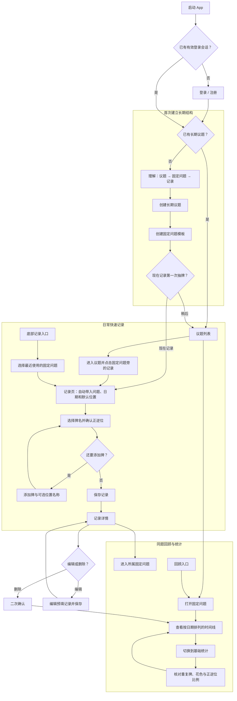

# Tarot Journal App MVP 信息架构

> 文档状态：MVP 信息架构初版
> 依据文档：`docs/PRODUCT_BRIEF.md`
> 核心结构：长期议题 → 固定问题 → 多次记录 → 牌位与牌
> 设计目标：新用户首次使用能够理解核心结构，常见的一张牌记录尽量在一分钟内完成。

## 0. 范围决策与术语

### 0.1 本文采用的最新范围

本文件采用最新需求：**每条记录至少包含一张牌，但不设置牌数上限**。这覆盖了 `PRODUCT_BRIEF.md` 中最小可验证版本曾建议的“每条记录 1–3 张牌”限制。

“每日录入少于一分钟”是常见一张牌记录的体验目标。任意数量的牌仍然受到支持，但十张牌等复杂牌阵无法合理承诺在一分钟内录完。产品应让录入时间尽量随牌数线性增加，不增加无关步骤。

### 0.2 核心对象

| 对象         | 定义                                                           | 示例                             |
| ------------ | -------------------------------------------------------------- | -------------------------------- |
| 长期议题     | 用户希望持续观察的一段生活主题，是所有内容的第一层归属         | 论文进展、关系发展、事业选择     |
| 固定问题     | 隶属于一个长期议题、会被重复使用的问题模板                     | 今天最值得优先处理的阻碍是什么？ |
| 默认牌阵位置 | 固定问题可以预设的一组有顺序的位置名称，可为空，也可有任意数量 | 现状、阻碍、建议                 |
| 记录         | 用户在某个日期针对一个固定问题完成的一次实体牌记录             | 2026-07-10 的论文进展记录        |
| 牌条目       | 一条记录中的一张牌，包含牌名、正逆位和可选位置名称             | 阻碍：宝剑八，逆位               |
| 后续反馈     | 事情发展后补充的事实或反思                                     | 下午完成了文献综述提纲           |

### 0.3 层级原则

```text
长期议题
└── 固定问题模板
    ├── 默认频率
    ├── 默认牌阵位置（可选、任意数量）
    └── 多次记录
        ├── 日期与时间
        ├── 牌条目（至少 1 张、任意数量）
        │   ├── 位置名称（可选）
        │   ├── 牌名
        │   └── 正位 / 逆位
        ├── 个人解读（可稍后补充）
        └── 后续反馈（可稍后补充）
```

所有历史和统计都保留“议题 + 固定问题”的上下文。MVP 不提供脱离问题语境的全局预测，也不把一次记录放在首页作为产品中心。

## 1. 底部导航

底部导航保留三个入口：

| 入口 | 类型         | 主要作用                                             | 设计说明                                                     |
| ---- | ------------ | ---------------------------------------------------- | ------------------------------------------------------------ |
| 议题 | 默认主页面   | 查看和管理长期议题，进入固定问题                     | 产品的核心入口，不额外设置含义模糊的“首页”                   |
| 记录 | 中央主要操作 | 快速选择固定问题并录入实体牌                         | 它是操作入口，不是一个长期停留的内容标签页；取消后返回原页面 |
| 回顾 | 顶层浏览页面 | 查看跨议题的最近记录，并进入某个固定问题的历史与统计 | 只负责寻找要复盘的内容，统计仍在固定问题页面中展示           |

设置与账户不占用底部导航位置，从“议题”和“回顾”页面右上角的账户图标进入。

### 1.1 导航规则

- 默认登录后进入“议题”。
- 新建或编辑表单使用全屏页面，底部导航隐藏，减少误触和中途离开。
- 从某个固定问题点击“记录”时，直接进入已带入上下文的记录页，不再重复选择问题。
- 从底部“记录”进入时，先显示最近使用的固定问题；用户选择一次后进入记录页。
- 保存记录后进入记录详情；返回时回到发起录入的固定问题或原标签页。
- 表单存在未保存修改时，返回操作需要先询问是否放弃修改。

## 2. 所有页面清单

页面按职责分为五组：

- 账户与进入：SYS-01 启动与会话检查、AUTH-01 登录 / 注册、ONB-01 首次使用说明。
- 长期议题：TOP-01 议题列表、TOP-02 新建 / 编辑议题、TOP-03 议题详情、TOP-04 已归档议题。
- 固定问题：QUE-01 新建 / 编辑固定问题、QUE-02 固定问题详情。
- 记录与回顾：REC-01 快速选择问题、REC-02 新建 / 编辑记录、REC-03 记录详情、REV-01 回顾。
- 账户管理：SET-01 设置与账户。

卡牌选择器、日期选择器、确认对话框和保存反馈属于辅助弹层，不作为底部导航页面。

## 3. 每个页面的主要目标

以下表格说明每个页面存在的理由和主要操作。

| 编号    | 页面                | 主要目标                                   | 主要内容与操作                                                           |
| ------- | ------------------- | ------------------------------------------ | ------------------------------------------------------------------------ |
| SYS-01  | 启动与会话检查      | 判断用户应该进入登录、首次使用还是主应用   | 品牌标识、短暂加载状态、会话恢复；不承担产品介绍                         |
| AUTH-01 | 登录 / 注册         | 用最少步骤建立私人账户                     | 登录或注册表单、错误提示、隐私说明入口                                   |
| ONB-01  | 首次使用说明        | 用一个具体例子解释“议题 → 固定问题 → 记录” | 一页说明、创建第一个议题按钮；不使用多页功能轮播                         |
| TOP-01  | 议题列表            | 让用户看到所有进行中的长期议题并快速继续   | 议题名称、固定问题数、最近记录日期、新建议题、进入归档议题               |
| TOP-02  | 新建 / 编辑议题     | 创建或维护长期议题的基本信息               | 名称、可选说明、保存；编辑模式提供归档操作                               |
| TOP-03  | 议题详情            | 围绕一个长期议题管理固定问题并查看近期活动 | 议题说明、固定问题列表、每个问题的“记录”快捷操作、近期记录、新建固定问题 |
| TOP-04  | 已归档议题          | 找回或查看不再活跃的议题                   | 归档列表、进入只读历史、恢复议题                                         |
| QUE-01  | 新建 / 编辑固定问题 | 建立可重复使用的问题及可选默认牌阵         | 问题文本、频率、默认位置列表、保存；编辑模式提供停用操作                 |
| QUE-02  | 固定问题详情        | 查看同一问题随时间的记录和事实统计         | 问题上下文、“时间线 / 统计”分段控件、记录按钮、编辑模板入口              |
| REC-01  | 快速选择问题        | 从全局“记录”入口快速确定本次记录归属       | 最近使用的问题、按议题分组的全部启用问题、问题搜索                       |
| REC-02  | 新建 / 编辑记录     | 高效录入日期、任意数量牌、解读和反馈       | 问题上下文、日期、牌条目列表、添加牌、个人解读、后续反馈、保存           |
| REC-03  | 记录详情            | 完整查看一次历史记录，并进入编辑或删除     | 议题、问题、日期、按顺序排列的牌与位置、解读、反馈、编辑、删除           |
| REV-01  | 回顾                | 跨议题找到最近记录或值得复盘的固定问题     | 按日期排列的最近记录、议题或问题筛选、可查看统计的问题入口               |
| SET-01  | 设置与账户          | 管理账户和基础偏好                         | 账户信息、隐私说明、退出登录；MVP 不放主题商店、牌组市场等扩展设置       |

### 3.1 辅助弹层与系统反馈

这些不是独立导航页面，但属于完整体验的一部分。

| 编号   | 弹层或反馈       | 用途                                                     |
| ------ | ---------------- | -------------------------------------------------------- |
| OVR-01 | 卡牌选择器       | 搜索并选择标准 78 张塔罗牌；选择后返回当前牌条目         |
| OVR-02 | 日期与时间选择器 | 修改默认的当前日期与时间                                 |
| OVR-03 | 确认对话框       | 处理删除记录、放弃未保存修改等不可逆或会丢失数据的操作   |
| OVR-04 | 轻量反馈         | 显示保存成功、归档成功、恢复成功，以及可重试的短错误提示 |

## 4. 页面之间的跳转关系

### 4.1 账户与首次使用

| 来源        | 操作或条件           | 目标                |
| ----------- | -------------------- | ------------------- |
| SYS-01 启动 | 无有效会话           | AUTH-01 登录 / 注册 |
| SYS-01 启动 | 已登录但没有任何议题 | ONB-01 首次使用说明 |
| SYS-01 启动 | 已登录且已有议题     | TOP-01 议题列表     |
| AUTH-01     | 登录成功且已有数据   | TOP-01 议题列表     |
| AUTH-01     | 首次注册成功         | ONB-01 首次使用说明 |
| ONB-01      | 创建第一个议题       | TOP-02 新建议题     |

### 4.2 议题与固定问题

| 来源                | 操作         | 目标                                        |
| ------------------- | ------------ | ------------------------------------------- |
| TOP-01 议题列表     | 点击议题     | TOP-03 议题详情                             |
| TOP-01 议题列表     | 点击新增     | TOP-02 新建议题                             |
| TOP-01 议题列表     | 打开归档     | TOP-04 已归档议题                           |
| TOP-02 新建议题     | 保存         | TOP-03 议题详情，并突出“创建第一个固定问题” |
| TOP-03 议题详情     | 编辑议题     | TOP-02 编辑议题                             |
| TOP-03 议题详情     | 点击固定问题 | QUE-02 固定问题详情                         |
| TOP-03 议题详情     | 新建固定问题 | QUE-01 新建固定问题                         |
| QUE-01 新建固定问题 | 保存         | QUE-02 固定问题详情                         |
| QUE-02 固定问题详情 | 编辑模板     | QUE-01 编辑固定问题                         |

### 4.3 记录与回顾

| 来源                | 操作                 | 目标                                    |
| ------------------- | -------------------- | --------------------------------------- |
| 任一底部主页面      | 点击中央“记录”       | REC-01 快速选择问题                     |
| REC-01 快速选择问题 | 选择固定问题         | REC-02 新建记录，自动带入问题与默认位置 |
| TOP-03 或 QUE-02    | 点击某问题旁的“记录” | REC-02 新建记录，跳过问题选择           |
| REC-02 新建记录     | 保存成功             | REC-03 记录详情                         |
| QUE-02 时间线       | 点击历史记录         | REC-03 记录详情                         |
| REV-01 回顾         | 点击历史记录         | REC-03 记录详情                         |
| REC-03 记录详情     | 编辑                 | REC-02 编辑记录                         |
| REC-03 记录详情     | 删除成功             | 返回对应的 QUE-02 时间线                |
| REV-01 回顾         | 点击固定问题         | QUE-02 固定问题详情                     |

### 4.4 跳转中的上下文保留

- 记录页顶部始终显示“议题名称 > 固定问题”，避免把记录保存到错误位置。
- 从固定问题进入记录页时，返回后保持原来的“时间线”或“统计”分段位置。
- 从回顾页打开详情再返回时，保留原筛选条件和滚动位置。
- 编辑固定问题后，历史记录保留记录发生时的问题文本和位置名称快照；模板修改只影响未来的新记录。

## 5. 新用户首次使用流程

### 目标

用户在没有阅读帮助文档的情况下，理解产品不是“先抽一次牌”，而是“先建立长期议题，再建立会重复使用的问题”。

### 流程

1. 用户完成登录或注册。
2. ONB-01 用一个例子展示：`论文进展 → 今天最大的阻碍是什么？ → 7 月 10 日的牌面记录`。
3. 用户点击“创建第一个议题”。
4. 在 TOP-02 输入必填的议题名称，可跳过说明，然后保存。
5. 新议题详情显示聚焦空状态：“下一步，添加一个会重复使用的问题”。
6. 用户进入 QUE-01，输入问题文本；频率默认为“按需”，默认牌阵位置可跳过。
7. 保存后进入 QUE-02。页面提供两个清晰选择：“记录第一次抽牌”和“稍后再记录”。
8. 若选择立即记录，进入已带入议题和问题的 REC-02；否则返回议题详情。

### 首次使用原则

- 不使用三到五页的介绍轮播。
- 不要求用户先配置提醒、头像、牌组或 AI 偏好。
- 只解释当前下一步，不在空状态中同时展示多个竞争按钮。
- 允许用户在创建固定问题后离开，不强迫当场抽牌。

## 6. 创建长期议题的流程

### 入口

- 首次使用说明中的“创建第一个议题”。
- TOP-01 右上角新增按钮。

### 步骤

1. 打开 TOP-02 新建议题。
2. 输入议题名称，必填，建议使用用户自己的自然表达，例如“论文进展”。
3. 可选填写说明，例如该议题的背景、目标或观察范围。
4. 点击保存。
5. 保存成功后进入 TOP-03 议题详情。
6. 如果这是新议题，页面主操作是“添加固定问题”；如果用户暂时不添加，也可以返回议题列表。

### 校验与边界

- 名称去除首尾空格后不能为空。
- 名称重复时给出非阻断提示，允许用户继续保存，因为相同名称可能代表不同阶段。
- MVP 不要求选择分类、颜色、图标、开始日期或目标日期。
- 议题不提供直接永久删除。用户可以归档，历史记录仍可查看，并可恢复。

## 7. 创建固定问题模板的流程

### 入口

- TOP-03 议题详情中的“添加固定问题”。
- 新议题保存后的聚焦空状态。

### 步骤

1. 打开 QUE-01，并在顶部持续显示所属议题。
2. 输入问题文本，必填。
3. 选择频率：每日、每周或按需；默认是按需。MVP 只保存频率，不发送提醒。
4. 选择是否设置默认牌阵位置。
5. 如果设置位置，输入第一个位置名称，并通过“添加位置”继续添加任意数量的位置。
6. 用户可以调整位置顺序、修改名称或移除位置。
7. 保存模板并进入 QUE-02 固定问题详情。

### 默认位置的行为

- 没有默认位置时，新记录从一个空牌条目开始，位置名称为可选。
- 有默认位置时，新记录自动为每个位置生成一个按顺序排列的牌条目。
- 用户在单次记录中仍可修改位置名称、移除不需要的位置或继续添加牌。
- 模板位置数量不构成记录牌数上限。
- 修改模板只影响之后创建的记录，不改写历史记录中的位置名称。

### 停用规则

固定问题不提供永久删除。停用后，它不再出现在快速记录选择器中，但其历史记录与统计仍然可查看；用户可以随时重新启用。

## 8. 每日快速录牌流程

### 8.1 两条入口路径

**最快路径：从上下文录入**

1. 用户在 TOP-03 的固定问题旁，或 QUE-02 顶部点击“记录”。
2. 直接进入 REC-02，议题、固定问题、当前日期和默认位置已带入。

**全局路径：从底部录入**

1. 用户点击底部中央“记录”。
2. REC-01 首先显示最近使用的固定问题，下面按议题分组显示其他启用问题。
3. 用户点选一个问题后进入 REC-02。

如果用户还没有固定问题，全局“记录”不会创建脱离议题的一次性占卜，而是引导用户先创建议题和固定问题。

### 8.2 记录页的默认状态

- 顶部显示议题名称和完整问题文本，可点击“更换”进入问题选择器。
- 日期和时间默认为当前值，收起显示，需要时再修改。
- 无默认位置时显示一个空牌条目。
- 有默认位置时显示相应数量的预填位置条目。
- 每个牌条目包含：位置名称、牌名、正位 / 逆位。
- 正位默认选中且始终清楚可见；用户抽到逆位时只需切换一次。
- 个人解读和后续反馈是可选输入，可在保存后补充。

### 8.3 录入牌面

1. 首个空牌条目自动获得输入焦点。
2. 用户输入牌名关键词，OVR-01 显示匹配的标准牌列表。
3. 选择牌后返回当前条目。
4. 根据实际情况保留正位或切换为逆位。
5. 位置名称已由模板带入；没有模板时可选填。
6. 点击“添加一张牌”继续录入，牌数没有硬上限。
7. 至少有一张完整的牌后即可保存；长解读与反馈可稍后填写。

### 8.4 一分钟目标

常见的一张牌、正位、已存在固定问题的路径应控制为：

```text
点击问题旁的“记录”
→ 搜索并选择牌
→ 点击“保存”
```

日期、问题和位置不需要重复输入。为了避免速度牺牲准确性，保存前仍需在页面上清楚显示问题归属、牌名和正逆位。

### 8.5 保存结果

- 保存中禁用重复提交，但不清空表单。
- 成功后进入 REC-03，并显示“已保存”。
- 用户可以立即补充解读或结束本次操作。
- 保存失败时保留所有已输入内容，显示原因与“重试”。MVP 不承诺跨设备或关闭 App 后恢复未保存草稿。

## 9. 查看同一问题历史趋势的流程

### 入口

- TOP-03 点击固定问题。
- REV-01 点击某个固定问题或该问题的一条记录。
- REC-03 点击顶部的问题名称。

### 流程

1. 进入 QUE-02，顶部固定显示所属长期议题和问题文本。
2. 默认打开“时间线”，按日期从新到旧展示记录。
3. 每条摘要显示日期、按位置排列的牌名与正逆位，以及解读或反馈摘要。
4. 用户点击任一记录进入 REC-03 查看完整内容。
5. 用户切换到“统计”。
6. 页面显示记录数、覆盖日期范围、重复牌与次数、大阿尔卡那及四种花色分布、正逆位比例。
7. 用户可返回时间线，将统计模式与具体日期记录相互核对。

### 展示边界

- 统计只针对当前固定问题，不默认混合其他问题的数据。
- 1–2 条记录时可以显示已有事实，但明确标注“样本较少，暂不足以判断稳定模式”。
- 达到 3 条记录后展示完整基础统计，仍持续显示样本量和日期范围。
- “趋势”指时间线变化和事实分布，不生成预测、因果解释或 AI 结论。
- MVP 默认统计全部历史，不加入自定义日期区间和复杂图表。

## 10. 编辑和删除记录的流程

### 10.1 编辑记录

1. 用户从 QUE-02 时间线或 REV-01 打开 REC-03。
2. 点击“编辑”，进入 REC-02 编辑模式。
3. 页面预填日期、固定问题、所有牌条目、位置名称、解读和反馈。
4. 用户可以修改字段、重新排序牌、添加任意数量牌或移除牌。
5. 点击保存后更新记录和当前固定问题的统计，再返回 REC-03。

如果用户更改记录所属的固定问题，保存前需要确认：“这条记录将移到另一个固定问题，并更新两个问题的统计。”

如果编辑时移除了已经保存的牌，最终保存前需要明确列出将移除的牌条目并确认。尚未保存的空白牌条目可以直接移除。

### 10.2 删除记录

1. 用户在 REC-03 的更多菜单中选择“删除记录”。
2. OVR-03 显示该记录的日期和固定问题，说明删除后无法恢复。
3. 用户再次点击破坏性操作“删除”。
4. 删除成功后返回 QUE-02 时间线，并重新计算统计。
5. 删除失败时停留在 REC-03，记录仍然可见，并提供重试。

MVP 不提供批量删除，也不允许从列表滑动一次完成删除，避免误操作。

## 11. 空状态、加载状态和错误状态

### 11.1 页面状态设计

| 页面或场景        | 空状态                                                       | 加载状态                                             | 错误状态与恢复                                           |
| ----------------- | ------------------------------------------------------------ | ---------------------------------------------------- | -------------------------------------------------------- |
| SYS-01 启动       | 不适用                                                       | 简洁启动状态，完成会话判断后立即跳转                 | 会话恢复失败时进入 AUTH-01，并说明需要重新登录           |
| TOP-01 议题列表   | “从一个想长期观察的主题开始”，唯一主操作为“创建议题”         | 使用议题行骨架，避免空白闪烁                         | 显示“无法加载议题”和重试；不把技术错误码展示给用户       |
| TOP-03 议题详情   | 没有问题时说明“固定问题会被重复使用”，主操作为“添加固定问题” | 议题标题和问题行使用骨架                             | 保留页面上下文，问题列表区域单独重试                     |
| TOP-04 已归档议题 | “还没有归档议题”，提供返回                                   | 使用列表骨架                                         | 显示重试，并允许返回进行中的议题                         |
| QUE-02 时间线     | “还没有这个问题的记录”，主操作为“记录第一次抽牌”             | 使用记录摘要骨架                                     | 显示重试；已加载的记录不因局部错误消失                   |
| QUE-02 统计       | 0 条时引导创建记录；1–2 条时显示样本不足说明                 | 统计区域使用稳定尺寸的占位，不显示虚假数字           | 显示统计加载失败和重试，时间线仍可使用                   |
| REC-01 问题选择   | 没有启用问题时引导创建议题或固定问题                         | 使用最近问题与分组行骨架                             | 显示重试；如果可读取本地已有上下文，则保留可选内容       |
| REC-02 记录表单   | 至少始终有一个牌条目，因此不使用整页空状态                   | 初次载入只占位上下文；保存时保留全部内容并显示进行中 | 校验错误贴近对应字段；网络失败保留输入并提供重试         |
| REV-01 回顾       | “完成第一次记录后，可在这里回看”，主操作进入议题             | 使用按日期分组的记录骨架                             | 显示重试；筛选器保持用户已选条件                         |
| REC-03 记录详情   | 不适用                                                       | 使用详情骨架                                         | 记录不存在或无权访问时说明“记录不可用”，提供返回对应议题 |

### 11.2 通用状态原则

- 列表和详情优先使用结构稳定的骨架，不让加载完成后页面大幅跳动。
- 只有初次会话检查可以使用整页加载；编辑中的表单不能被整页加载覆盖。
- 字段校验错误显示在字段附近，并说明如何修正。
- 网络错误不等同于数据为空，两种状态使用不同文案。
- 保存失败时不清空输入，也不自动退出表单。
- 删除失败时不提前从界面移除记录。
- 不直接展示数据库、服务器或堆栈错误；记录技术细节供调试，用户只看到可执行的恢复操作。
- 统计样本不足属于正常状态，不使用警告色，也不把它描述为错误。

## 12. 需要二次确认的操作

二次确认只用于不可逆、会丢失已保存数据，或会明显改变统计归属的操作。可撤销操作使用轻量反馈，不频繁弹窗打断用户。

| 操作                       | 是否二次确认 | 处理方式                                     |
| -------------------------- | ------------ | -------------------------------------------- |
| 删除一条已保存记录         | 是           | 显示日期、所属问题和“无法恢复”，再次点击删除 |
| 编辑时移除已保存的牌并保存 | 是           | 保存前列出将移除的牌条目                     |
| 把记录移动到另一个固定问题 | 是           | 说明两个问题的历史和统计都会更新             |
| 离开有未保存修改的表单     | 是           | 提供“继续编辑”和“放弃修改”                   |
| 归档长期议题               | 否           | 归档可恢复，完成后显示“撤销”或进入归档页恢复 |
| 停用固定问题               | 否           | 停用可恢复，历史不删除，完成后提供“撤销”     |
| 移除尚未填写的牌条目       | 否           | 直接移除                                     |
| 退出登录                   | 通常否       | 如果当前存在未保存表单，先处理“放弃修改”确认 |

MVP 不提供永久删除长期议题或固定问题，因此不需要为这两类对象设计级联删除确认。

## 13. 文本版页面地图

```text
Tarot Journal App
├── 未登录区
│   ├── SYS-01 启动与会话检查
│   └── AUTH-01 登录 / 注册
│
├── 首次使用区（仅无议题的新用户进入）
│   ├── ONB-01 首次使用说明
│   ├── TOP-02 新建议题
│   └── QUE-01 新建固定问题
│
└── 已登录主应用
    ├── 底部入口：议题
    │   ├── TOP-01 议题列表
    │   │   ├── TOP-02 新建 / 编辑议题
    │   │   └── TOP-04 已归档议题
    │   └── TOP-03 议题详情
    │       ├── QUE-01 新建 / 编辑固定问题
    │       ├── QUE-02 固定问题详情
    │       │   ├── 时间线
    │       │   └── 统计
    │       └── REC-03 记录详情
    │           └── REC-02 编辑记录
    │
    ├── 底部入口：记录（主要操作）
    │   ├── REC-01 快速选择问题
    │   ├── REC-02 新建记录
    │   │   ├── OVR-01 卡牌选择器
    │   │   └── OVR-02 日期与时间选择器
    │   └── REC-03 记录详情
    │
    ├── 底部入口：回顾
    │   ├── REV-01 最近记录与问题筛选
    │   ├── REC-03 记录详情
    │   └── QUE-02 固定问题详情
    │       ├── 时间线
    │       └── 统计
    │
    └── 顶部账户入口
        └── SET-01 设置与账户
```

## 14. 主要用户流程图



## 15. MVP 导航验收标准

信息架构进入线框图前，应满足以下条件：

- 新用户不需要先创建一次性占卜，就能理解议题和固定问题的关系。
- 从固定问题到一张牌保存，除牌名输入外只需要极少操作。
- 记录页始终明确显示所属议题和固定问题。
- 一条记录可以添加任意数量牌，每张牌都能单独设置位置名称和正逆位。
- 用户可以从议题、回顾和记录详情三条路径回到同一问题的时间线。
- 统计不会脱离固定问题，也不会用预测性语言解释数据。
- 删除记录、移除已保存牌和放弃未保存修改都有明确保护。
- 每个核心页面都有空、加载和错误状态，不依赖用户猜测下一步。

## 当前最短价值路径

```text
创建长期议题
→ 创建固定问题和可选默认位置
→ 快速记录一张或多张实体牌
→ 稍后补充解读与反馈
→ 查看同题时间线
→ 查看基于真实记录的基础统计
```

后续页面或功能只有在能缩短这条路径、提高记录准确性，或增强同题复盘价值时，才应进入 MVP。
